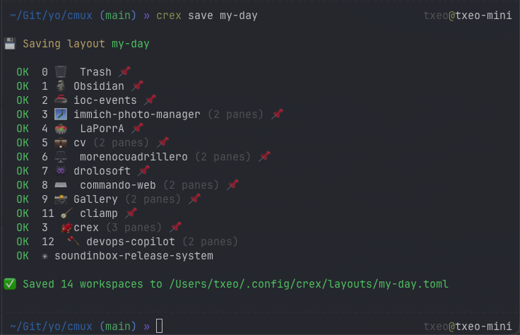
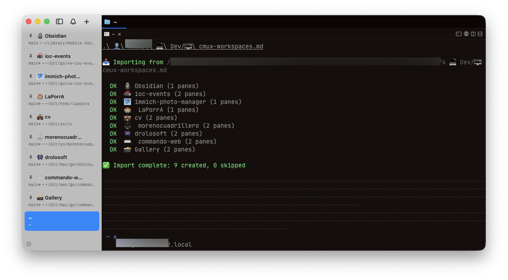
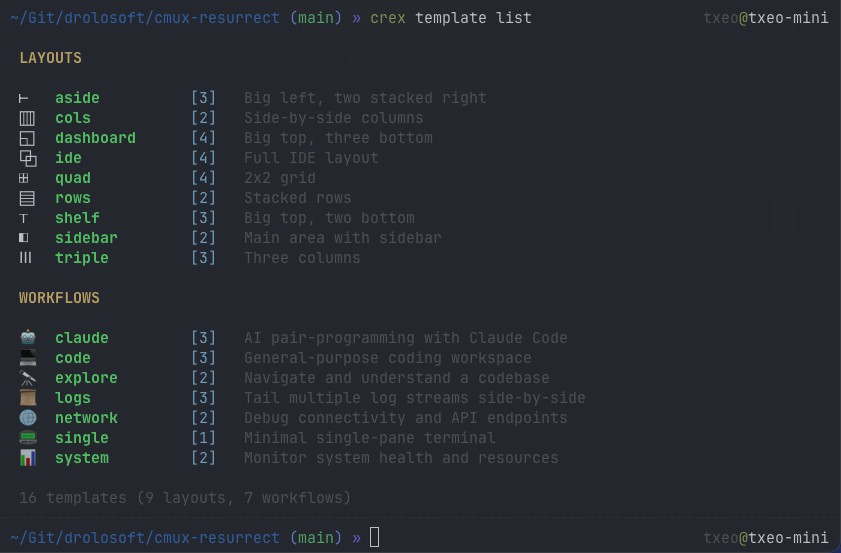

<p align="center"></p>

<h1 align="center">crex <sup><sub>(cmux-resurrect)</sub></sup></h1>

<p align="center">
  <a href="https://github.com/drolosoft/cmux-resurrect/actions/workflows/ci.yml"></a>
  <a href="https://goreportcard.com/report/github.com/drolosoft/cmux-resurrect"></a>
  <a href="https://pkg.go.dev/github.com/drolosoft/cmux-resurrect"></a>
  <a href="https://codecov.io/gh/drolosoft/cmux-resurrect"></a>
  <a href="https://opensource.org/licenses/MIT"></a>
  <a href="https://github.com/drolosoft/homebrew-tap"></a>
  <a href="https://github.com/drolosoft/cmux-resurrect/releases"></a>
  <a href="https://github.com/manaflow-ai/cmux"></a>
</p>

> **Save, restore, and template your terminal workspaces — for [cmux](https://github.com/manaflow-ai/cmux) and [Ghostty](https://ghostty.org/).**

Inspired by [tmux-resurrect](https://github.com/tmux-plugins/tmux-resurrect) (12.7K stars), **crex** (short for cmux-resurrect) was born to do for [cmux](https://github.com/manaflow-ai/cmux) what tmux-resurrect does for tmux — and then went further. With **Workspace Blueprints**, a **template gallery**, and now **multi-backend support**, crex saves your entire layout and brings it back: workspaces, splits, CWDs, pinned state, startup commands, everything.

crex takes its name from the corncrake (*Crex crex*) — a migratory bird that returns to the same ground year after year. A phoenix of the grasslands. Much like your terminal workspaces, resurrected.

<p align="center"></p>

---

## 🚀 Quick Start

### Install with Homebrew (recommended)

```sh
brew install drolosoft/tap/crex            # preferred
brew install drolosoft/tap/cmux-resurrect  # also works — same formula
```

Both `crex` and `cmux-resurrect` commands are ready to use, with shell completions installed automatically. No Go toolchain required. macOS only (both cmux and Ghostty's AppleScript API are macOS-native).

### Install with `go install`

```sh
go install github.com/drolosoft/cmux-resurrect/cmd/crex@latest
```

> For building from source, see [docs/building.md](docs/building.md).

### Enable Shell Completion

Homebrew users get completions automatically. For manual installs, add one line to your shell config:

```sh
eval "$(crex completion zsh)"    # zsh — add to ~/.zshrc
eval "$(crex completion bash)"   # bash — add to ~/.bashrc
crex completion fish | source    # fish — run once
```

Now `crex <TAB>` shows all commands, `crex restore <TAB>` completes your saved layout names, and flags like `--mode` complete their values. See [docs/shell-completion.md](docs/shell-completion.md) for the full guide.

### Try it

```sh
crex save my-day                # snapshot your current layout
crex save my-day --dry-run      # or preview first without saving
```

---

## 💾 Save & Restore

```sh
crex save my-day              # snapshot your layout
crex restore my-day           # bring it all back
```

Every workspace, split, CWD, pinned state, and startup command — captured and restored. Layouts are saved to `~/.config/crex/layouts/`.

<p align="center"></p>

## 📥 Workspace Blueprints

Define your workspaces in Obsidian-compatible Markdown. Import creates only what's missing — it's idempotent.

```markdown
## Projects
**Icon | Name | Template | Pin | Path**

- [x] | 🌐 | webapp    | dev     | yes | ~/projects/webapp
- [x] | ⚙️ | api       | dev     | yes | ~/projects/api-server
- [x] | 🧪 | tests     | go      | yes | ~/projects/testing

## Templates

### dev
- [x] main terminal (focused)
- [x] split right: `npm run dev`
- [x] split right: `lazygit`
```

```sh
crex import-from-md           # create workspaces from Blueprint
crex export-to-md             # capture live state to Blueprint
```

<p align="center"></p>

> For the full Blueprint format, templates, and CLI management, see [docs/blueprint.md](docs/blueprint.md).

## 📦 Template Gallery

crex ships with 16 ready-to-use workspace templates for common developer workflows.

| | Layout Templates | | Workflow Templates |
|---|---|---|---|
| ▥ | `cols` — side-by-side | 🤖 | `claude` — Claude Code pair-programming |
| ▤ | `rows` — stacked | 💻 | `code` — general coding |
| ◧ | `sidebar` — main + side | 🔭 | `explore` — navigate codebase |
| ⊤ | `shelf` — big top, 2 bottom | 📊 | `system` — monitor health |
| ⊢ | `aside` — big left, 2 right | 📜 | `logs` — tail streams |
| Ⅲ | `triple` — three columns | 🌐 | `network` — debug connectivity |
| ⊠ | `quad` — 2×2 grid | 📟 | `single` — minimal terminal |
| ◱ | `dashboard` — top + 3 bottom | | |
| ⧉ | `ide` — full IDE layout | | |

```sh
crex template list                    # browse all templates
crex template show claude             # preview with ASCII diagram
crex template use claude ~/project    # create workspace instantly
crex template customize claude        # fork to your Blueprint
```

<p align="center"></p>

> Templates are starting points. Run `crex template customize <name>` to fork any template and make it yours.

See [docs/templates.md](docs/templates.md) for the full gallery with diagrams.

## Supported Backends

| Backend | Status | Tested versions | Detection |
|---------|--------|-----------------|-----------|
| [cmux](https://github.com/manaflow-ai/cmux) | Full support (original backend) | 0.62.1, 0.63.2 | Auto-detected via `CMUX_SOCKET_PATH` |
| [Ghostty](https://ghostty.org/) | Full support (v1.3+ macOS) | 1.3 | Auto-detected when Ghostty is running |

crex auto-detects your terminal backend — no flags needed. Just run your commands and crex figures out the rest:

```sh
crex save my-day        # works in cmux or Ghostty
crex restore my-day     # recreates layout in whichever backend you're in
crex template use dev   # same templates, any backend
```

All features — save, restore, import, export, templates, Blueprints — work identically across backends. The template gallery is 100% backend-agnostic.

---

## ✨ Why crex?

[tmux-resurrect](https://github.com/tmux-plugins/tmux-resurrect) proved that session persistence is essential for any serious terminal multiplexer workflow. Every multiplexer eventually gets one — crex started as that tool for cmux, and now brings the same power to Ghostty.

| | tmux-resurrect | crex |
|:---:|---|---|
| 📝 | Plugin configuration | **Workspace Blueprint** — Markdown files, Obsidian-compatible |
| 🧩 | Manual pane recreation | **16 built-in templates** + custom Blueprints |
| 📥 | One-way restore | **Bidirectional** — import from and export to Markdown |
| 👁️ | Execute immediately | **Dry-run mode** — preview every command first |
| ⏱️ | Manual saves | **Auto-save with launchd** — deduped, zero-maintenance |
| 📋 | Edit config files | **CLI workspace management** — `add`, `remove`, `toggle` from terminal |
| 🔤 | Basic tab completion | **Dynamic completions** — layout names, workspace names, flag values (bash/zsh/fish) |

---

## 📚 Documentation

| Doc | Description |
|-----|-------------|
| [Commands](docs/commands.md) | Full command reference, flags, and recipes |
| [Workspace Blueprints](docs/blueprint.md) | Blueprint format, templates, CLI management |
| [Workflows](docs/workflows.md) | Save/Restore vs Import, dry-run, side-by-side comparison |
| [Configuration](docs/configuration.md) | config.toml reference and defaults |
| [Auto-Save](docs/auto-save.md) | launchd integration for macOS |
| [Template Gallery](docs/templates.md) | Built-in templates, ASCII previews, customization |
| [Template Authoring](docs/template-authoring.md) | Create and contribute custom templates |
| [Shell Completion](docs/shell-completion.md) | Setup, troubleshooting, what gets completed |
| [Building from Source](docs/building.md) | Makefile targets, cross-compilation, platform support |
| [Architecture](ARCHITECTURE.md) | Internal design for contributors |

---

## 🌟 Contributing

Contributions are welcome — bug fixes, new templates, feature ideas. Open an issue or submit a PR.

If crex saves your sessions, consider giving it a ⭐ on GitHub — it helps others discover the project.

---

## ☕ Support

If crex saved you time or made your workflow easier, consider buying me a coffee — it keeps the next one coming!

<p align="center"><a href="https://buymeacoffee.com/juan.andres.morenorub.io"></a></p>

---

## 📜 License

**MIT License** — free to use, modify, and distribute.

Born from a real need: a crashed cmux session took an hour of carefully arranged workspaces with it. `crex` now protects your workspaces across both cmux and Ghostty — so that never happens again.

**Forged by [Drolosoft](https://drolosoft.com)** · *Tools we wish existed*
