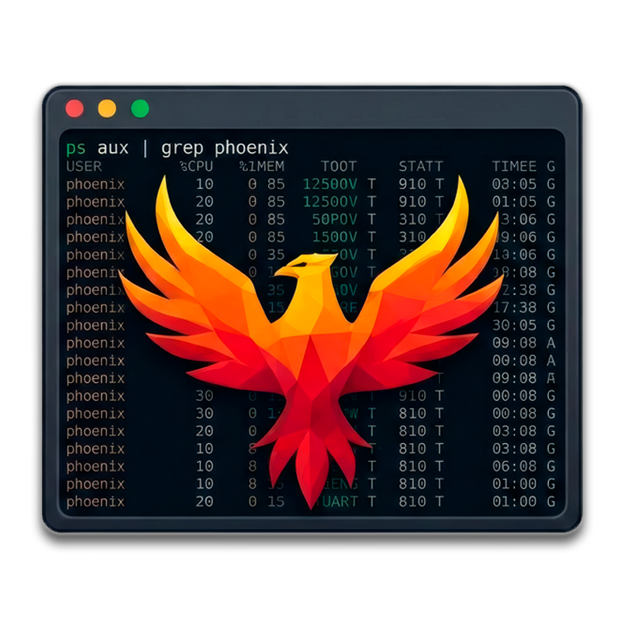
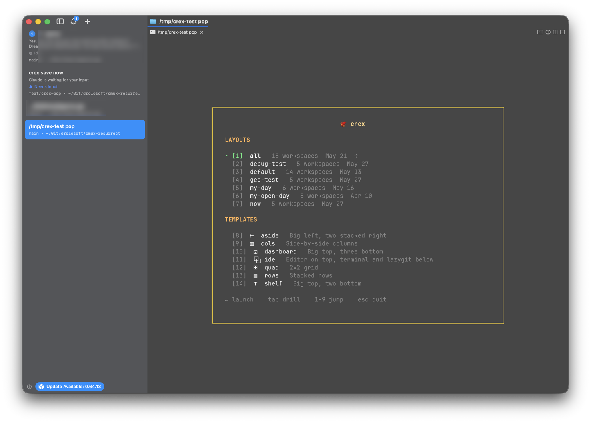
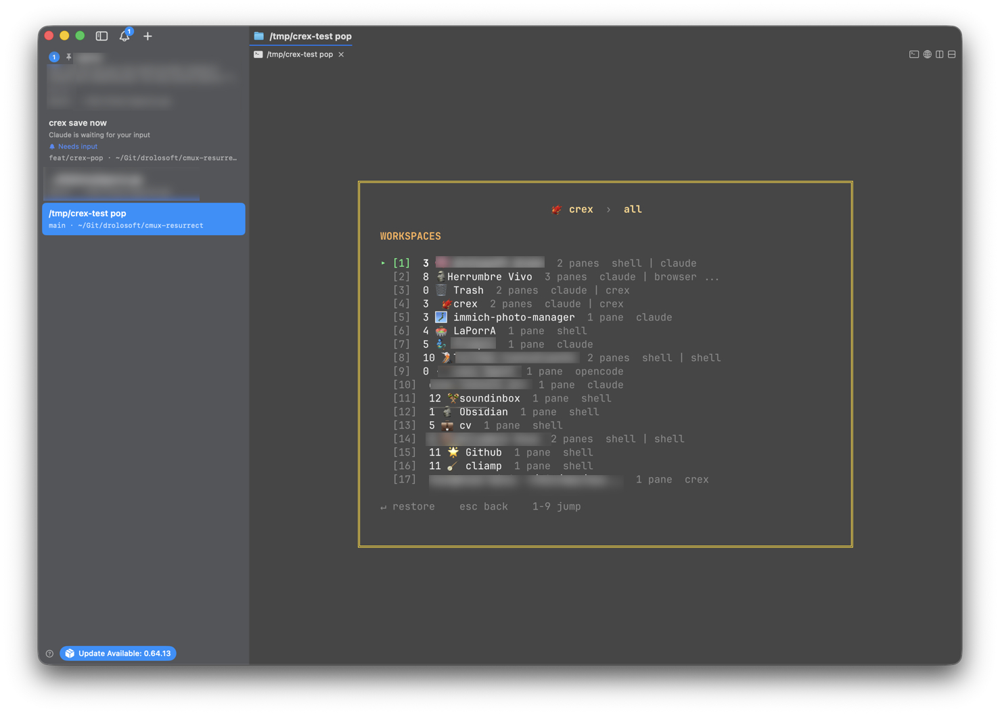
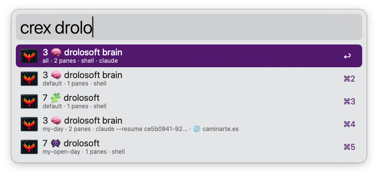

<p align="center"></p>

<h1 align="center">crex <sup><sub>(cmux-resurrect)</sub></sup></h1>

<p align="center">
  <a href="https://ghostty.org/"></a>
  <a href="https://github.com/manaflow-ai/cmux"></a>
  <a href="https://github.com/drolosoft/cmux-resurrect/releases/latest"></a>
  <a href="https://goreportcard.com/report/github.com/drolosoft/cmux-resurrect"></a>
  <a href="https://opensource.org/licenses/MIT"></a>
  <a href="https://github.com/drolosoft/homebrew-tap"></a>
</p>

> **Design, manage, and automate terminal workspaces — for [cmux](https://github.com/manaflow-ai/cmux) and [Ghostty](https://ghostty.org/).**

Save layouts by name. Restore them anytime. Switch between them in seconds. Resume AI coding sessions mid-conversation. Launch workspaces from Alfred. 🐦‍🔥

<p align="center"></p>

---

### Features

<table>
<tr>
<td width="50%" valign="top">

**💾 [Save & Restore](docs/commands.md)**<br>
Every tab, pane, CWD, and command — captured and restored by name, with the exact split arrangement.

**📦 [16 Templates](docs/templates.md)**<br>
Instant workspace setup — splits, IDE layouts, AI pair-programming.

**📝 [Markdown Blueprints](docs/blueprint.md)**<br>
Obsidian-compatible, version-controlled, shareable workspace definitions.

</td>
<td width="50%" valign="top">

**🤖 [AI Auto-Detection](docs/commands.md#ai-session-auto-detection)**<br>
15 AI tools detected. Sessions resume mid-conversation automatically.

**🔍 [Alfred Integration](docs/alfred.md)** <sup>NEW</sup><br>
Search and launch any workspace from Alfred with one keystroke.

**⚡ [Auto-Accept](docs/configuration.md#auto-accept-for-ai-agents)** <sup>NEW</sup><br>
Skip permission prompts on restore for Claude, Codex, OpenCode, and 10 more.

</td>
</tr>
</table>

---

### Quick Start

```sh
brew install drolosoft/tap/crex       # install
crex setup                            # first-run wizard (ships a demo layout)
crex restore demo                     # try the bundled example — safe anywhere
crex save my-day                      # snapshot your layout
crex restore my-day                   # bring it all back
crex pop                              # instant workspace picker (Ctrl+G)
```

<p align="center"></p>

> Also available via `go install github.com/drolosoft/cmux-resurrect/cmd/crex@latest`. See [Building](docs/building.md).

---

### Instant Workspace Picker

Type `crex pop` or hit **Ctrl+G** — a floating picker with fuzzy search across all layouts, templates, and individual workspaces.

<p align="center"></p>

Tab into any layout to browse its workspaces:

<p align="center"></p>

---

### Alfred Integration

Search and restore workspaces directly from Alfred. Type `crex` + your query — every saved workspace is searchable by name.

<p align="center"></p>

| Key | Action |
|-----|--------|
| Enter | Restore workspace |
| Cmd+Enter | Restore full layout |
| Alt+Enter | Show layout details |
| Ctrl+Enter | Open TOML file |

Works with both **cmux** and **Ghostty**. See [Alfred setup guide](docs/alfred.md) for installation.

---

### One Command, Full IDE

```sh
crex template use ide
```

<p align="center"></p>

16 built-in templates — from simple splits to monitoring dashboards. See the [Template Gallery](docs/templates.md).

---

### AI Session Resume

`crex save` detects running AI sessions and captures their session IDs. On restore, each resumes exactly where you left off — per pane **and per tab**, so a workspace holding one tab per git worktree comes back with every tab on its own conversation.

```
crex❯ save my-day

📦 my-day
   7 🧩 drolosoft 📌
   ├── claude --resume 90d6d97b... ★
   └── →right 🌐 https://drolosoft.com/

   🚀 Homepage 📌
   ├── npm run dev
   ├── →right nvim CLAUDE.md ★
   └── →right 🌐 http://localhost:3000/
```

15 tools supported: Claude Code, OpenCode, Codex, Amp, Gemini CLI, Copilot, Grok, Cursor, Aider, and more. Any foreground process (npm, nvim, htop) is also detected and restored.

And it works both ways — `crex skill install` teaches Claude Code and Codex to drive crex themselves: snapshot before risky changes, restore layouts non-interactively, resume sessions. See [crex skill](docs/commands.md#crex-skill--teach-your-ai-agents-to-drive-crex).

Configure [auto-accept](docs/configuration.md#auto-accept-for-ai-agents) to skip permission prompts on restore — agents start in autonomous mode automatically.

---

### Interactive Shell

`crex tui` — a REPL with browse mode, numbered items, history, and tab completion.

<p align="center"></p>

---

### Supported Backends

| Backend | Status | Detection |
|---------|--------|-----------|
| [cmux](https://github.com/manaflow-ai/cmux) | Full support | Auto-detected via `CMUX_SOCKET_PATH`, verified alive (falls back to a running Ghostty if the socket is dead) |
| [Ghostty](https://ghostty.org/) | Full support | Auto-detected when running |

macOS only. Both backends auto-detected — same commands, same templates, same Blueprints. Per-pane working directories work on both; exact split geometry is cmux-only for now ([backend differences](docs/commands.md#backend-differences)).

---

### vs cmux native restore

| | cmux native | crex |
|---|---|---|
| 🔄 | Restores last session on relaunch | **Named layout library** — switch between saved layouts |
| 📐 | No templates | **16 built-in templates** |
| 📝 | JSON snapshots | **Markdown Blueprints** — Obsidian-compatible |
| 🔍 | AI tools via hooks | **Any foreground process** — npm, vim, htop, all detected |
| ⚡ | Automatic on relaunch | **On-demand** — filter, dry-run, restore specific workspaces |
| ⏱️ | Saves on quit | **Watch daemon** — background auto-save |

---

### Documentation

| | |
|---|---|
| [Commands](docs/commands.md) | Full command reference |
| [Templates](docs/templates.md) | 16 built-in templates with diagrams |
| [Blueprints](docs/blueprint.md) | Markdown workspace definitions |
| [Alfred](docs/alfred.md) | Alfred workflow setup |
| [Configuration](docs/configuration.md) | config.toml, auto-accept, env vars |
| [Auto-Save](docs/auto-save.md) | Daemon, shell hooks, launchd |
| [Shell Completion](docs/shell-completion.md) | bash, zsh, fish setup |
| [Workflows](docs/workflows.md) | Save/Restore vs Import comparison |
| [Building](docs/building.md) | Build from source |

---

### Contributing

Contributions welcome — bug fixes, templates, feature ideas. Open an issue or PR.

If crex saves your sessions, a ⭐ helps others discover it.

### Support

<p align="center"><a href="https://buymeacoffee.com/juan.andres.morenorub.io"></a></p>

---

**MIT License** · **Forged by [Drolosoft](https://drolosoft.com)** · *Tools we wish existed*
