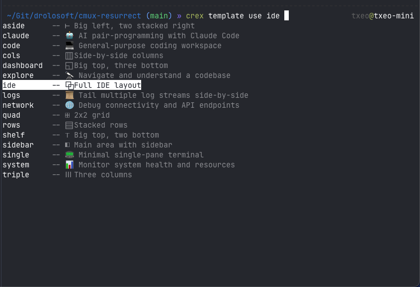

[Home](../README.md) > Shell Completion

# 🔤 Shell Completion

crex supports **tab completion** for commands, subcommands, layout names, workspace names, and flag values across **bash, zsh, and fish**.

## What Gets Completed

| When you type... | TAB gives you... |
|---|---|
| `crex <TAB>` | All available commands (save, restore, list, ...) |
| `crex res<TAB>` | `restore` (partial subcommand match) |
| `crex restore <TAB>` | Your saved layout names (from `~/.config/crex/layouts/`) |
| `crex restore my-<TAB>` | Layout names starting with `my-` |
| `crex restore --mode <TAB>` | `replace`, `add` |
| `crex delete <TAB>` | Saved layout names |
| `crex show <TAB>` | Saved layout names |
| `crex edit <TAB>` | Saved layout names |
| `crex watch <TAB>` | Saved layout names |
| `crex watch --interval <TAB>` | Common intervals: `1m`, `5m`, `10m`, `30m` |
| `crex workspace remove <TAB>` | Workspace names from the Blueprint |
| `crex workspace toggle <TAB>` | Workspace names from the Blueprint |
| `crex ws add myproj --template <TAB>` | Template names from the gallery (16 templates) |
| `crex template show <TAB>` | Gallery template names with icons and descriptions |
| `crex template use <TAB>` | Gallery template names, then directory paths |
| `crex template customize <TAB>` | Gallery template names with icons and descriptions |
| `crex template list --tag <TAB>` | Available tags: `basic`, `3-pane`, `ai`, `monitoring`, etc. |
| `crex ws add myproj <TAB>` | Directory completion for the path argument |
| `crex --config <TAB>` | `.toml` files |
| `crex --layouts-dir <TAB>` | Directories |
| `crex --workspace-file <TAB>` | `.md` files |

**Descriptions** are shown alongside completions in zsh and fish:

```
$ crex restore <TAB>
autosave    -- 5 workspaces
my-day      -- Friday standup layout
production  -- 3 workspaces
```

Template completions include icons and descriptions:

<p align="center"></p>

---

## Setup

### Homebrew (zero-config for zsh/fish)

If you installed via `brew install drolosoft/tap/crex` (or `cmux-resurrect`), completions are installed automatically. **No setup needed.**

### Manual Setup

Generate and source the completion script for your shell:

**Zsh** (add to `~/.zshrc`):
```zsh
eval "$(crex completion zsh)"
```

**Bash** (add to `~/.bashrc` or `~/.bash_profile`):
```bash
eval "$(crex completion bash)"
```

**Fish** (run once — persistent):
```fish
crex completion fish > ~/.config/fish/completions/crex.fish
```

**PowerShell** (add to `$PROFILE`):
```powershell
crex completion powershell | Out-String | Invoke-Expression
```

After adding the line, restart your shell or source the config file.

---

## Troubleshooting

### Completions show files/folders instead of commands

**Symptom:** You type `crex <TAB>` and see directory listings instead of commands like `save`, `restore`, `list`.

**Cause:** Zsh caches completion functions in `~/.zcompdump`. If crex was installed or upgraded after your shell session started, the cache doesn't include the new `_crex` completion function. Zsh falls back to its default file completion.

**Fix:** Rebuild the completion cache and restart your shell:

```zsh
rm -f ~/.zcompdump*
exec zsh
```

This deletes the stale cache and starts a fresh shell that will rebuild it with `_crex` included.

### Completions don't work with carapace installed

**Symptom:** You have [carapace](https://github.com/carapace-sh/carapace-bin) installed (`source <(carapace _carapace)` in your `.zshrc`) and crex completions don't appear.

**Fix:** Add this line to your `~/.zshrc` **after** the carapace source line:

```zsh
source <(carapace _carapace)        # your existing carapace line
eval "$(crex completion zsh)"       # add this AFTER carapace
```

This ensures crex's Cobra-generated completion takes priority over carapace's catch-all handler.

### Verify completions are working

Run the hidden `__complete` command directly to check if the Go binary is producing correct output:

```zsh
crex __complete ""
```

You should see a list of commands (save, restore, list, ...) followed by `:4` on the last line. If you see this output but TAB still doesn't work, the issue is on the shell side (stale cache — see above).

### After `brew upgrade`, completions stopped working

This is the same stale-cache issue. Homebrew installs the new completion file, but your running shell still uses the old cache. Run:

```zsh
rm -f ~/.zcompdump*
exec zsh
```

---

## How It Works

### Architecture

```
User presses TAB
       │
       ▼
Shell completion script (generated by `crex completion <shell>`)
       │
       ▼
Shell calls: crex __complete <partial-command> <partial-args>
       │
       ▼
Cobra parses the command tree, identifies the target command
       │
       ▼
Calls ValidArgsFunction or RegisterFlagCompletionFunc
       │
       ▼
Go function reads from disk (store.List() or mdfile.Parse())
       │
       ▼
Returns completions + ShellCompDirective to stdout
       │
       ▼
Shell displays suggestions to user
```

### Key Design Decisions

1. **Cobra's built-in completion system** — zero extra dependencies. The same approach used by `gh`, `kubectl`, `hugo`, and `goreleaser`. We write completion logic once in Go and it works identically across bash, zsh, fish, and PowerShell.

2. **Not carapace, not go-complete, not readline** — Cobra's built-in system covers the four shells that matter for our users (macOS/Linux terminal users who use tmux/cmux). Carapace adds exotic shell support (Elvish, Nushell) that our audience doesn't need. go-complete duplicates Cobra's command tree. Readline is for REPLs, not CLIs.

3. **Dynamic completions from disk** — layout names come from `store.List()` (reads `~/.config/crex/layouts/*.toml`), workspace names come from `mdfile.Parse()` (reads the Workspace Blueprint). These are the same codepaths used by the actual commands — single source of truth.

4. **Fail-silent** — completion functions never print errors or return error directives. If the store directory doesn't exist or the blueprint is malformed, we return an empty completion list. A missing suggestion is invisible; a printed error corrupts the shell's completion buffer.

5. **`ShellCompDirectiveNoFileComp` everywhere** — without this directive, Cobra falls back to filesystem completion, which is wrong for layout/workspace name arguments. The only exception is `ws add <name> <path>` where the second argument uses `ShellCompDirectiveFilterDirs` for directory completion.

6. **Description annotations** — completions use `"name\tdescription"` format. Zsh and fish render this as two columns. Bash ignores the description gracefully.

### File Structure

```
cmd/
├── completion.go           # The `crex completion` command
├── completion_helpers.go   # Shared completion functions
├── completion_test.go      # Tests for completion helpers
├── save.go                 # ← ValidArgsFunction = completeLayoutNames
├── restore.go              # ← ValidArgsFunction + RegisterFlagCompletionFunc("mode")
├── delete.go               # ← ValidArgsFunction = completeLayoutNames
├── show.go                 # ← ValidArgsFunction = completeLayoutNames
├── edit.go                 # ← ValidArgsFunction = completeLayoutNames
├── watch.go                # ← ValidArgsFunction + RegisterFlagCompletionFunc("interval")
├── ws_remove.go            # ← ValidArgsFunction = completeWorkspaceNames
├── ws_toggle.go            # ← ValidArgsFunction = completeWorkspaceNames
└── ws_add.go               # ← RegisterFlagCompletionFunc("template") + FilterDirs
```

### Shared Helpers

Two reusable functions in `cmd/completion_helpers.go`:

**`completeLayoutNames`** — returns saved layout names with descriptions. Used by: `save`, `restore`, `delete`, `show`, `edit`, `watch`.

```go
func completeLayoutNames(cmd *cobra.Command, args []string, toComplete string) ([]string, cobra.ShellCompDirective)
```

**`completeWorkspaceNames`** — returns project names from the Workspace Blueprint with template/status annotations. Used by: `ws remove`, `ws toggle`.

```go
func completeWorkspaceNames(cmd *cobra.Command, args []string, toComplete string) ([]string, cobra.ShellCompDirective)
```

Both functions:
- Only complete the **first positional argument** (`len(args) > 0` → return empty)
- Return `cobra.ShellCompDirectiveNoFileComp` to prevent filesystem fallback
- Silently return empty on any error (store not found, parse failure, permission denied)

### Completion Command

`crex completion <shell>` generates the shell-specific script:

```go
var completionCmd = &cobra.Command{
    Use:       "completion [bash|zsh|fish|powershell]",
    ValidArgs: []string{"bash", "zsh", "fish", "powershell"},
    Args:      cobra.MatchAll(cobra.ExactArgs(1), cobra.OnlyValidArgs),
    RunE:      runCompletion,
}
```

Uses `rootCmd.GenBashCompletionV2()`, `GenZshCompletion()`, `GenFishCompletion()`, and `GenPowerShellCompletionWithDesc()`.

### Flag Completions

| Command | Flag | Values |
|---|---|---|
| `restore` | `--mode` | `replace` (Close existing workspaces), `add` (Keep existing) |
| `watch` | `--interval` | `1m`, `5m`, `10m`, `30m` |
| `ws add` | `--template` | `dev`, `go`, `single`, `monitor` |
| root | `--config` | `.toml` files (via `MarkPersistentFlagFilename`) |
| root | `--layouts-dir` | directories (via `MarkPersistentFlagDirname`) |
| root | `--workspace-file` | `.md` files (via `MarkPersistentFlagFilename`) |

### Error Handling

| Scenario | Behavior |
|---|---|
| `~/.config/crex/layouts/` doesn't exist | `newStore()` creates it via `os.MkdirAll`; `List()` returns empty; no suggestions |
| Store directory is empty | `List()` returns empty `[]LayoutMeta`; no suggestions |
| Corrupt TOML in layouts dir | `store.List()` skips corrupt files (existing behavior); remaining layouts shown |
| Workspace Blueprint missing | `mdfile.Parse()` returns error; `completeWorkspaceNames` returns empty |
| Blueprint is malformed | `mdfile.Parse()` returns partial results; we complete what we can |
| Permission denied on store | Return empty slice; no stderr output |

---

## Debugging Completions

Test completions without a shell by calling the hidden `__complete` command directly:

```sh
# Show all completions for `crex restore`
crex __complete restore ""

# Show completions matching prefix "my-"
crex __complete restore "my-"

# Show --mode flag completions
crex __complete restore -- --mode ""

# Show workspace name completions
crex __complete workspace remove ""

# Show all subcommands
crex __complete ""
```

The last line of output is a numeric directive (`:0` = default, `:4` = no file completion).

For verbose debug logs (bash only):

```sh
BASH_COMP_DEBUG_FILE=/tmp/crex-debug.log crex __complete restore ""
cat /tmp/crex-debug.log
```

**Critical rule**: completion functions must never write to stdout. Stdout output is interpreted as completions. Use `cobra.CompDebugln()` for debug output or write to stderr.

---

## Homebrew Distribution

The `.goreleaser.yml` generates completion scripts at build time and the Homebrew formula installs them:

```yaml
before:
  hooks:
    - mkdir -p completions
    - sh -c "go run . completion bash > completions/crex.bash"
    - sh -c "go run . completion zsh  > completions/_crex"
    - sh -c "go run . completion fish > completions/crex.fish"

brews:
  - install: |
      bin.install "crex"
      bash_completion.install "completions/crex.bash" => "crex"
      zsh_completion.install "completions/_crex"
      fish_completion.install "completions/crex.fish"
```

For zsh and fish, Homebrew's install locations are already on the completion search path, so completions work out of the box.

---

## Implementation Checklist

- [x] `cmd/completion_helpers.go` — `completeLayoutNames`, `completeWorkspaceNames`
- [x] `cmd/completion.go` — `crex completion` command
- [x] `cmd/completion_test.go` — unit tests
- [x] `cmd/save.go` — `ValidArgsFunction = completeLayoutNames`
- [x] `cmd/restore.go` — `ValidArgsFunction` + `RegisterFlagCompletionFunc("mode")`
- [x] `cmd/delete.go` — `ValidArgsFunction = completeLayoutNames`
- [x] `cmd/show.go` — `ValidArgsFunction = completeLayoutNames`
- [x] `cmd/edit.go` — `ValidArgsFunction = completeLayoutNames`
- [x] `cmd/watch.go` — `ValidArgsFunction` + `RegisterFlagCompletionFunc("interval")`
- [x] `cmd/ws_remove.go` — `ValidArgsFunction = completeWorkspaceNames`
- [x] `cmd/ws_toggle.go` — `ValidArgsFunction = completeWorkspaceNames`
- [x] `cmd/ws_add.go` — `RegisterFlagCompletionFunc("template")` + `FilterDirs`
- [x] `cmd/root.go` — `MarkPersistentFlagFilename/Dirname` for global flags
- [x] `Makefile` — `completions` target
- [x] `.goreleaser.yml` — completion script generation + Homebrew install
- [x] `docs/commands.md` — add completion to command reference

---

## Test Coverage

All completion behavior is tested at three levels:

### 1. Unit Tests (helper logic)

| Test | What it verifies |
|---|---|
| `TestCompleteLayoutNames_EmptyStore` | Returns empty + NoFileComp when no layouts |
| `TestCompleteLayoutNames_WithLayouts` | Returns sorted names with descriptions |
| `TestCompleteLayoutNames_SecondArgBlocked` | No completions after first arg is provided |
| `TestCompleteLayoutNames_StoreError` | Silently returns empty on store error |
| `TestCompleteWorkspaceNames_MissingFile` | Silently returns empty when blueprint missing |
| `TestCompleteWorkspaceNames_WithProjects` | Returns project names with annotations |
| `TestCompleteWorkspaceNames_SecondArgBlocked` | No completions after first arg |

### 2. Wiring Verification Tests

| Test | What it verifies |
|---|---|
| `TestWiring_LayoutCommandsHaveValidArgsFunction` | save, restore, delete, show, edit, watch all have ValidArgsFunction |
| `TestWiring_WorkspaceCommandsHaveValidArgsFunction` | ws remove, ws toggle, ws add all have ValidArgsFunction |
| `TestWiring_CommandsWithoutArgsDontNeedCompletion` | list, version, export-to-md, import-from-md, ws list do NOT have spurious ValidArgsFunction |
| `TestCompletionCommand_ValidArgs` | completion command accepts exactly bash, zsh, fish, powershell |

### 3. End-to-End Tests (full `__complete` pipeline)

| Test | What it verifies |
|---|---|
| `TestE2E_SubcommandCompletion_AllCommands` | `crex <TAB>` returns all 12+ commands, excludes hidden ones |
| `TestE2E_SubcommandPartialMatch` | `res` → `restore`, `de` → `delete`, `com` → `completion`, `w` → `watch`+`workspace` |
| `TestE2E_RestoreLayoutNames` | `crex restore <TAB>` returns layout names with descriptions, directive=NoFileComp |
| `TestE2E_RestoreLayoutNames_PartialMatch` | Returns all layouts (shell does prefix filtering) |
| `TestE2E_DeleteLayoutNames` | `crex delete <TAB>` returns layout names |
| `TestE2E_ShowLayoutNames` | `crex show <TAB>` returns layout names |
| `TestE2E_EditLayoutNames` | `crex edit <TAB>` returns layout names |
| `TestE2E_SaveLayoutNames` | `crex save <TAB>` returns layout names |
| `TestE2E_WatchLayoutNames` | `crex watch <TAB>` returns layout names |
| `TestE2E_LayoutNoSecondArg` | All 6 layout commands block completions after the name |
| `TestE2E_RestoreModeFlag` | `--mode <TAB>` → replace, add (with descriptions) |
| `TestE2E_WatchIntervalFlag` | `--interval <TAB>` → 1m, 5m, 10m, 30m |
| `TestE2E_WsAddTemplateFlag` | `--template <TAB>` → dev, go, single, monitor (with descriptions) |
| `TestE2E_WorkspaceSubcommands` | `crex workspace <TAB>` → add, remove, toggle, list |
| `TestE2E_WsRemoveWorkspaceNames` | `crex ws remove <TAB>` → workspace names from blueprint |
| `TestE2E_WsToggleWorkspaceNames` | `crex ws toggle <TAB>` → workspace names from blueprint |
| `TestE2E_WsAddFirstArgNoFileComp` | First arg (name) has NoFileComp directive |
| `TestE2E_WsAddSecondArgFilterDirs` | Second arg (path) has FilterDirs directive |
| `TestE2E_WsAlias` | `crex ws <TAB>` works (alias for workspace) |
| `TestE2E_DeleteAlias` | `crex rm <TAB>` returns layout names (alias for delete) |
| `TestE2E_ListAlias` | `crex l<TAB>` matches list |
| `TestE2E_CompletionShellNames` | `crex completion <TAB>` → bash, zsh, fish, powershell |
| `TestE2E_CompletionPartialMatch` | `crex completion ba<TAB>` → bash only |
| `TestE2E_ConfigFlagFiltersTOML` | `--config` directive=FilterFileExt for .toml |
| `TestE2E_LayoutsDirFlagFiltersDirs` | `--layouts-dir` directive=FilterDirs |
| `TestE2E_WorkspaceFileFlagFiltersMD` | `--workspace-file` directive=FilterFileExt for .md |

### 4. Completion Command Output Tests

| Test | What it verifies |
|---|---|
| `TestCompletionCommand_GeneratesOutput` | bash, zsh, fish, powershell all generate non-empty scripts |

### 5. ws add Argument Tests

| Test | What it verifies |
|---|---|
| `TestWsAddCompletion_FirstArgNoFileComp` | Name arg: NoFileComp |
| `TestWsAddCompletion_SecondArgFilterDirs` | Path arg: FilterDirs |
| `TestWsAddCompletion_ThirdArgBlocked` | No completions for extra args |

**Total: 38 completion tests across all layers.**

---

See also: [Commands](commands.md) | [Configuration](configuration.md) | [Building](building.md)
