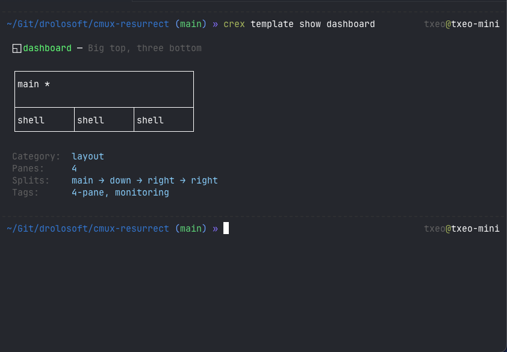
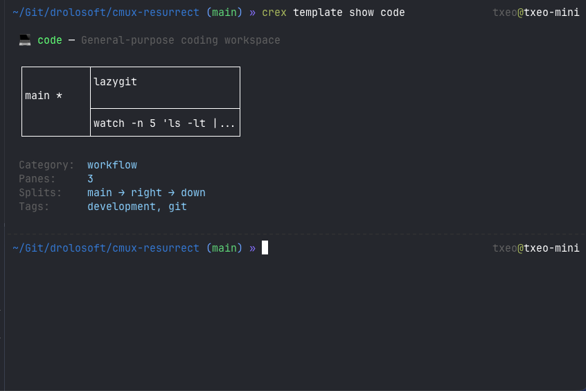

[Home](../README.md) > Template Gallery

# Template Gallery

crex ships with 16 ready-to-use workspace templates for common developer workflows. Browse them with `crex template list`, preview any with `crex template show`, and create a workspace instantly with `crex template use`.

<p align="center">


</p>

## Quick Start

```sh
crex template list                    # browse all templates
crex template show claude             # preview with ASCII diagram
crex template use claude ~/project    # create workspace instantly
crex template customize claude        # fork to your Blueprint
```

---

## Layout Templates

Layout templates define pane geometry with no pre-configured commands. Use them as starting points when you just need the split arrangement.

### ▥ cols — Side-by-side columns

Two vertical panes, equal weight.

```
┌──────────┬───────────────────────┐
│          │                       │
│  main *  │  shell                │
│          │                       │
└──────────┴───────────────────────┘
```

- **Panes:** 2
- **Splits:** main → right
- **Use case:** Editor + terminal, code review side-by-side, comparing output

### ▤ rows — Stacked rows

Two horizontal panes, top and bottom.

```
┌──────────────────────────────────┐
│           main *                 │
├──────────────────────────────────┤
│           shell                  │
└──────────────────────────────────┘
```

- **Panes:** 2
- **Splits:** main → down
- **Use case:** Code on top, output below; main workspace with a watch pane

### ◧ sidebar — Main area with sidebar

Two vertical panes: main workspace on the left, narrow sidebar on the right.

```
┌──────────┬───────────────────────┐
│          │                       │
│  main *  │  shell                │
│          │                       │
└──────────┴───────────────────────┘
```

- **Panes:** 2
- **Splits:** main → right
- **Use case:** Editor with a file watcher, main task with reference material

### ⊤ shelf — Big top, two bottom

Large main pane on top, two smaller panes side-by-side on the bottom.

```
┌──────────────────────────────────┐
│            main *                │
│                                  │
├────────────────┬─────────────────┤
│    shell       │    shell        │
└────────────────┴─────────────────┘
```

- **Panes:** 3
- **Splits:** main → down → right
- **Use case:** Editor on top, tests and git below; main task with two helpers

### ⊢ aside — Big left, two stacked right

Tall main pane on the left, two stacked panes on the right.

```
┌──────────┬───────────────────────┐
│          │  shell                │
│  main *  │                       │
│          ├───────────────────────┤
│          │  shell                │
└──────────┴───────────────────────┘
```

- **Panes:** 3
- **Splits:** main → right → down
- **Use case:** Editor with tests and git stacked on the right

### Ⅲ triple — Three columns

Three equal vertical columns.

```
┌──────────┬──────────┬──────────┐
│          │          │          │
│  main *  │  shell   │  shell   │
│          │          │          │
└──────────┴──────────┴──────────┘
```

- **Panes:** 3
- **Splits:** main → right → right
- **Use case:** Comparing three files, multi-service monitoring, frontend + backend + logs

### ⊠ quad — 2x2 grid

Four panes in a 2x2 grid.

```
┌────────────────┬─────────────────┐
│    main *      │    shell        │
├────────────────┼─────────────────┤
│    shell       │    shell        │
└────────────────┴─────────────────┘
```

- **Panes:** 4
- **Splits:** main → right → down (pane 0) → down (pane 1)
- **Use case:** Four services, multi-project work, dashboard with four feeds

### ◱ dashboard — Big top, three bottom

Large main pane on top, three equal columns below.

```
┌──────────────────────────────────┐
│            main *                │
│                                  │
├──────────┬──────────┬──────────┤
│  shell   │  shell   │  shell   │
└──────────┴──────────┴──────────┘
```

- **Panes:** 4
- **Splits:** main → down → right → right
- **Use case:** Main editor with three utility panes, monitoring dashboard

### ⧉ ide — Full IDE layout

File tree sidebar, large editor area, console and tools at the bottom-right.

```
┌────────┬─────────────────────────┐
│        │  shell *                │
│ main   │                         │
│        ├────────────┬────────────┤
│        │  shell     │  shell     │
└────────┴────────────┴────────────┘
```

- **Panes:** 4
- **Splits:** main → right (focused) → down → right
- **Use case:** Full development environment with file browser, editor, terminal, and tools

---

## Workflow Templates

Workflow templates combine layout geometry with pre-configured commands. They give you a ready-to-use workspace for a specific task.

### 🤖 claude — Claude Code pair-programming

A workspace for pair-programming with [Claude Code](https://docs.anthropic.com/en/docs/claude-code/overview). lazygit on the left, Claude Code session in the main area, a shell below.

```
┌──────────┬───────────────────────┐
│          │  claude *             │
│  lazygit │                       │
│          ├───────────────────────┤
│          │  shell                │
└──────────┴───────────────────────┘
```

- **Panes:** 3
- **Splits:** main (lazygit) → right (Claude Code, focused) → down
- **Use case:** Coding sessions with Claude Code, reviewing changes alongside the conversation

### 💻 code — General-purpose coding

Editor-focused workspace with git and a file watcher.

```
┌──────────┬───────────────────────┐
│          │  lazygit              │
│  main *  │                       │
│          ├───────────────────────┤
│          │  watch -n 5 'ls...'   │
└──────────┴───────────────────────┘
```

- **Panes:** 3
- **Splits:** main (focused) → right (lazygit) → down (watch)
- **Use case:** Day-to-day coding with git integration and file monitoring

### 🔭 explore — Navigate and understand a codebase

Quick navigation setup for diving into unfamiliar code.

```
┌──────────┬───────────────────────┐
│          │                       │
│  main *  │  git log --oneline... │
│          │                       │
└──────────┴───────────────────────┘
```

- **Panes:** 2
- **Splits:** main (focused) → right (git log)
- **Use case:** Code archaeology, onboarding to a new repo, tracing history

### 📊 system — Monitor system health

System monitoring with htop and disk usage.

```
┌──────────┬───────────────────────┐
│          │                       │
│  htop    │  df -h               │
│          │                       │
└──────────┴───────────────────────┘
```

- **Panes:** 2
- **Splits:** main (htop) → right (df -h)
- **Use case:** Quick system health check, resource monitoring during builds

### 📜 logs — Tail multiple log streams

Multiple log streams side-by-side for debugging.

```
┌──────────┬───────────────────────┐
│          │  dmesg -T | tail...   │
│ tail * │                       │
│          ├───────────────────────┤
│          │  shell                │
└──────────┴───────────────────────┘
```

- **Panes:** 3
- **Splits:** main (system.log, focused) → right (dmesg) → down
- **Use case:** Debugging with multiple log sources, watching service output

### 🌐 network — Debug connectivity

Network diagnostics workspace.

```
┌──────────┬───────────────────────┐
│          │                       │
│  main *  │  curl -s ifconfig...  │
│          │                       │
└──────────┴───────────────────────┘
```

- **Panes:** 2
- **Splits:** main (focused) → right (curl)
- **Use case:** API debugging, connectivity checks, DNS troubleshooting

### 📟 single — Minimal single-pane terminal

A single focused terminal. The simplest possible workspace.

```
┌──────────────────────────────────┐
│                                  │
│            main *                │
│                                  │
└──────────────────────────────────┘
```

- **Panes:** 1
- **Splits:** main
- **Use case:** Quick one-off tasks, scratch workspace, focused single-task work

---

## Customization

Any gallery template can be forked into your Workspace Blueprint for customization:

```sh
crex template customize claude
```

This copies the template definition into your Blueprint file. Your copy takes priority over the built-in version, so you can change commands, add panes, or adjust the layout.

To revert to the built-in version, remove the template section from your Blueprint.

### Resolution Order

When crex resolves a template name, it checks three tiers in order:

1. **Your Blueprint** — templates defined in your `workspaces.md`
2. **Gallery** — the 16 built-in templates
3. **Fallback** — a single focused terminal pane

This means your customizations always win. You can override any built-in template by defining one with the same name in your Blueprint.

---

See also: [Template Authoring](template-authoring.md) | [Workspace Blueprints](blueprint.md) | [Commands](commands.md)
